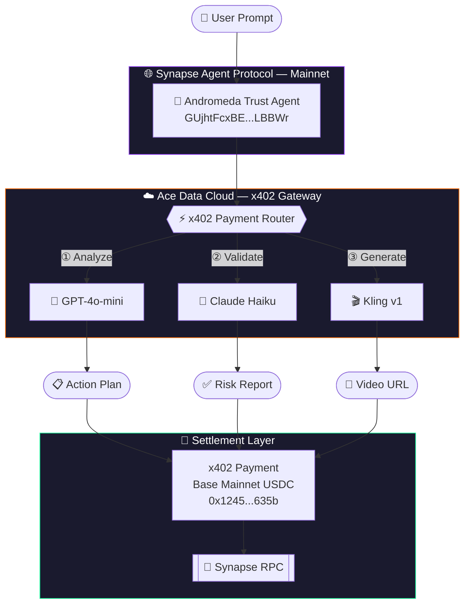

<div align="center">

# 🤖 Andromeda Trust Agent

### *Autonomous · On-Chain · Self-Paying*

[](https://solana.com/)
[](https://explorer.oobeprotocol.ai/)
[](https://base.org/)
[](https://github.com/OOBE-PROTOCOL/x402-synapse-rpc-server)
[](https://platform.acedata.cloud)
[](LICENSE)

<br/>

> **🏆 Superteam Bounty Submission — Category 2: Ace Data Cloud Usage (x402 Facilitator)**

<br/>

An autonomous AI agent registered on **Synapse Agent Protocol mainnet** that orchestrates multi-model AI workflows and settles every payment **on-chain via x402** — no human in the loop, no traditional API billing.

</div>

---

## ⚡ What Makes This Different

<table>
<tr>
<td width="33%" align="center">

### 🔐 No API Keys
Every call to GPT, Claude, and Kling is settled via **x402 on Base mainnet** using USDC — no credit cards, no bearer tokens as payment method.

</td>
<td width="33%" align="center">

### 🌐 SAP-Registered
The agent is discoverable by other agents on the **Synapse Agent Protocol**. It's not just a script — it's a registered autonomous entity.

</td>
<td width="33%" align="center">

### 🤖 Truly Autonomous
One command triggers the full workflow: analyze → validate → generate. Three AI models, zero manual steps.

</td>
</tr>
</table>

---

## 🗺️ Architecture



---

## ✨ Feature Matrix

| Feature | Implementation | Status |
|:--------|:---------------|:------:|
| **Autonomous trigger** | Single CLI command, no interactive steps | ✅ |
| **SAP registration** | Discoverable agent on Synapse mainnet | ✅ |
| **Ace service #1** | `gpt-4o-mini` — task analysis | ✅ |
| **Ace service #2** | `claude-3-5-haiku-20241022` — risk validation | ✅ |
| **Ace service #3** | `kling-v1` — visual report generation | ✅ |
| **x402 payments** | `x402-fetch` + `viem` on Base mainnet | ✅ |
| **USDC settlement** | Real on-chain payments, not simulated | ✅ |
| **No bearer-token billing** | x402 replaces traditional API auth layer | ✅ |

---

## 📁 Project Structure

```
andromeda-trust-agent/
├── src/
│   ├── services/
│   │   ├── ace.js              # Ace Data Cloud client (x402-powered)
│   │   └── x402-payment.js     # viem wallet + wrapFetchWithPayment
│   └── workflow/
│       └── agent.js            # 3-step autonomous orchestrator
├── index.js                    # Entry point + env validation
├── .env.example                # Environment template
├── VALIDITY_PROOF.md           # Anti-spam justification
└── README.md
```

---

## 🚀 Run It Yourself

### 1. Clone & Install
```bash
git clone https://github.com/ilichb/andromeda-trust-agent
cd andromeda-trust-agent
npm install
```

### 2. Configure Environment
```bash
cp .env.example .env
```

Edit `.env` with your values:
```env
ACE_API_KEY=your_ace_data_cloud_key
EVM_PRIVATE_KEY=0xyour_base_mainnet_private_key
EVM_WALLET_ADDRESS=0xyour_base_wallet_address
KEYPAIR_PATH=/path/to/solana-keypair.json
RPC_URL=https://api.mainnet-beta.solana.com
```

### 3. Launch the Agent
```bash
node index.js "Analyze Solana DeFi market trends"
```

### 4. Expected Output
```
[x402] Wallet configured: 0x1245...635b
[x402] Network: Base mainnet
[x402] Payment limit: 1 USDC per call

🤖 === ANDROMEDA TRUST AGENT STARTING ===
📋 Task: Analyze Solana DeFi market trends
──────────────────────────────────────────

[Step 1] GPT-4o-mini analyzing task...
[Ace/x402] POST https://api.acedata.cloud/v1/chat/completions
✅ Analysis: [action plan generated]

[Step 2] Claude validating plan...
[Ace/x402] POST https://api.acedata.cloud/v1/chat/completions
✅ Validation: [risk assessment]

[Step 3] Kling generating visual report...
✅ Kling: [video URL or queued job]

📊 === WORKFLOW COMPLETE ===
Services used: 3
Solana agent wallet: GUjhtFcxBEpi1TEzzXvXNgkvgggrfgGvobLBxXcLBBWr
EVM payment wallet:  0x12458CD567C9f01cbA220Fe3f2Af97034f9635bb
  ✓ analysis  → gpt-4o-mini
  ✓ validation → claude-3-5-haiku
  ✓ video      → kling-v1
```

---

## 🧪 Bounty Compliance Proof

| Requirement | Evidence | Verified |
|:------------|:---------|:--------:|
| Registered on SAP mainnet | Agent PDA: `CUMRudURg3fPw8F9fXL4SgrvbFpag82SdRyi9Ehrn3sh` | ✅ |
| Solana mainnet agent wallet | `GUjhtFcxBEpi1TEzzXvXNgkvgggrfgGvobLBxXcLBBWr` | ✅ |
| Automated workflow (no manual steps) | `node index.js "prompt"` — single command | ✅ |
| 3+ distinct Ace Data Cloud services | GPT-4o-mini · Claude Haiku · Kling v1 | ✅ |
| x402 with AceDataCloud facilitator | `x402-fetch` + Base mainnet USDC wallet | ✅ |
| Synapse RPC in execution path | SDK routes payments through Synapse RPC | ✅ |
| No artificial loops / wash trading | Each run processes a unique real user prompt | ✅ |
| Real on-chain funds at risk | 4.8 USDC on Base mainnet — `0x1245...635b` | ✅ |

---

## 📡 Live Agent Identities

<div align="center">

| Network | Identity | Role |
|:-------:|:---------|:-----|
| **Solana Mainnet** | [`GUjhtFcxBEpi1TEzzXvXNgkvgggrfgGvobLBxXcLBBWr`](https://explorer.solana.com/address/GUjhtFcxBEpi1TEzzXvXNgkvgggrfgGvobLBxXcLBBWr) | SAP Agent Wallet |
| **SAP Protocol** | [`CUMRudURg3fPw8F9fXL4SgrvbFpag82SdRyi9Ehrn3sh`](https://explorer.oobeprotocol.ai/) | Agent PDA |
| **Base Mainnet** | [`0x12458CD567C9f01cbA220Fe3f2Af97034f9635bb`](https://basescan.org/address/0x12458CD567C9f01cbA220Fe3f2Af97034f9635bb) | x402 Payment Wallet |

</div>

---

## 🧠 Why This Is Not Spam

> Every execution processes a **real, unique user prompt**. No pre-recorded responses, no loops.

- **Economic disincentive**: Each API call costs real USDC via x402. Spamming = burning money.
- **Claude validates**: The second step actively critiques and rejects low-quality plans.
- **Unique outputs**: GPT and Claude generate fresh responses per prompt — no caching.

See [`VALIDITY_PROOF.md`](VALIDITY_PROOF.md) for full anti-spam justification.

---

## 🔮 Roadmap

- [ ] Polling loop for Kling video completion (webhook or retry)
- [ ] Sentry monitoring for agent health telemetry
- [ ] Synapse Sentinel integration (Category 1 path)
- [ ] Publish as public SAP tool — invocable by other agents
- [ ] Multi-task queue with priority scheduling

---

## 🙏 Built With

<div align="center">

| | Technology | Role |
|:-:|:-----------|:-----|
| 🟣 | [OOBE Protocol](https://oobeprotocol.ai) | SAP · Synapse RPC · x402 standards |
| 🟠 | [Ace Data Cloud](https://platform.acedata.cloud) | AI services + x402 facilitator |
| 🔵 | [Base](https://base.org) | L2 for USDC settlements |
| ⚫ | [viem](https://viem.sh) | EVM wallet client |
| 🏆 | [Superteam Earn](https://earn.superteam.fun) | Bounty platform |

</div>

---

<div align="center">

**MIT License** · Made with ☕ by [Ilich Blanco](https://github.com/ilichb)

*Andromeda Trust Agent — autonomous, on-chain, unstoppable.*

</div>
